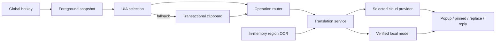

# Architecture

## Boundary

OneBoard is one per-user WPF process targeting .NET 10, Windows x64, and PerMonitorV2 DPI awareness. It has no backend, account, telemetry SDK, history database, browser scraper, auto-send path, Ollama integration, or general-purpose LLM.

## Components

| Area | Responsibility |
|---|---|
| `Infrastructure` | Win32 hotkeys, foreground identity, keyboard chords, single instance, clipboard safety |
| `Services` | capture/replacement, versioned settings, startup, routing, reply, tray, result policy/positioning |
| `Providers` | official cloud HTTP contracts and provider code normalization |
| `Local` | trusted manifests, secure downloads/activation, persistent private worker, bounded model cache, direct/pivot provider |
| `Models` | canonical language catalog, provider capabilities, translation/result/settings domain |
| `Security` | current-user DPAPI credentials |
| `OCR` | monitor-aware region selection, in-memory GDI capture, Windows OCR |
| `Views` | Settings, Reply Mode, region selection |
| `Diagnostics` | allow-listed metadata-only JSON Lines |

## Translation routing

`ITranslationService` creates only the configured provider. Normal cloud translation uses one provider request when source detection can occur in the same request. Capability lists are fetched separately only from Settings/Reply capability workflows and cached as non-sensitive metadata for 24 hours. If a cached target list proves the requested target is unsupported, routing stops before sending content.

Provider identifiers are normalized into canonical internal language IDs such as `zh-Hans`; each provider maps those IDs at its boundary.

Local mode constructs `LocalTranslationProvider` and never a cloud fallback. It selects an installed direct direction first, otherwise an installed two-leg route through English for Vietnamese↔Chinese. A persistent JSON-lines child process hosts CTranslate2/SentencePiece, retains at most the configured number of models, and is terminated on cancellation or app exit. User text travels only through anonymous pipes and is not placed in arguments, files, exceptions, or logs.

## Local install trust boundary

The base app packages only the small worker source and a hard-coded manifest. Runtime/model payloads are downloaded by explicit user action over HTTPS into a random temporary path, checked for exact size and SHA-256, extracted with traversal rejection, validated for expected direction/files, and moved atomically into `%LOCALAPPDATA%\OneBoardInlineTranslate\models`. Failed and cancelled staging files are cleaned. Unverified payloads are never activated.

## Result window

One `OverlayWindow` instance is reused:

- Popup: `WS_EX_NOACTIVATE`, pointer-near-selection proxy or chosen monitor corner, work-area clamping, auto-hide.
- Pinned: activating, draggable/resizable persistent surface; physical bounds and monitor name saved after movement and recovered against available work areas.
- Hidden: quick replacement success has no result surface; errors/unsafe replacement and explicit Understand/OCR results remain visible in the smallest surface.

Long content is scroll-bounded. Positioning uses monitor pixels and current window DPI; WPF sizes are converted at the native boundary.

## Safety invariants

- Only Ctrl+C and Ctrl+V are synthesized. No Enter key constant or send/submit integration exists.
- The hotkey-time HWND/process remains authoritative and is revalidated before synthetic input.
- Clipboard capture eagerly snapshots all safely cloneable formats, applies Windows history/cloud exclusion to temporary values, and restores independently of operation cancellation.
- Reply Insert is explicit and falls back to Copy if the recorded destination cannot be safely restored.
- OCR pixels remain in memory, are released promptly, and are never uploaded or persisted.

## State and secrets

Versioned non-sensitive JSON is stored at `%LOCALAPPDATA%\OneBoardInlineTranslate\settings.json`. Schema 2 migrates old values and adds quick targets, recent languages, result settings/bounds, capability cache, and local cache limits. Credentials remain in a separate current-user DPAPI file with provider-specific names.

Diagnostics include timestamp, process, operation, provider, capture method, capture/provider/output/total timing, success, and exception type only. Text, screenshots, keys, response bodies, and exception messages are excluded.
