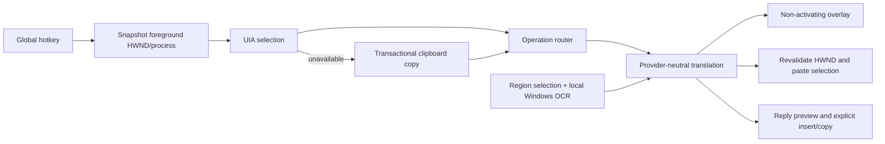

# Architecture

## Product boundary

OneBoard Inline Translate is one per-user WPF process targeting .NET 10 and Windows x64. It has no backend, account system, database, telemetry SDK, translation history, browser scraper, or auto-send capability.

## Runtime flow

## Components

| Area | Responsibility |
|---|---|
| `Infrastructure` | Win32 hotkeys, foreground identity, keyboard chords, single instance, and transactional clipboard safety |
| `Services` | capture/replacement, settings, startup, translation orchestration, language detection, reply, tray, and overlay positioning |
| `Providers` | supported Azure Translator, DeepL, and LibreTranslate-compatible HTTP contracts |
| `Security` | per-user DPAPI credential protection |
| `OCR` | region selection orchestration, in-memory screen capture, and Windows OCR |
| `Views` | Settings, Reply Mode, and region selection WPF surfaces |
| `Diagnostics` | metadata-only local JSON Lines logging |

## Safety invariants

### No automatic send

The only synthesized input chords are Ctrl+C and Ctrl+V. No Enter virtual key is declared. The application does not discover or invoke send buttons, submit forms, target application APIs, or message APIs. Reply Mode inserts only after an explicit click and never sends.

### Clipboard transaction

Before temporary clipboard use, every advertised format is eagerly materialized into an independent `DataObject`. If any value cannot be cloned safely, the operation aborts before mutation. Temporary data carries `ExcludeClipboardContentFromMonitorProcessing`; restoration uses a persistent clipboard write with a longer retry window and is not cancelled when the originating operation is cancelled.

### Foreground authority

The hotkey-time HWND and process ID are authoritative. Ctrl+C and Ctrl+V are emitted only after the HWND is revalidated as the foreground window. Reply Mode may reactivate its recorded source window after explicit Insert; it verifies the HWND still exists, belongs to the same process, and becomes foreground. Failure falls back to explicit clipboard copy.

### Non-activating overlay

The translation overlay uses `WS_EX_NOACTIVATE`, `WS_EX_TOOLWINDOW`, `ShowActivated=false`, `SWP_NOACTIVATE`, and a `WM_MOUSEACTIVATE` guard. Placement is computed in monitor pixel coordinates and clamped to the work area.

## Translation architecture

`ITranslationService` accepts a `TranslationRequest` and delegates to an `ITranslationProvider`. Capture, overlay, replace, reply, and OCR code depend only on the service interface. Domain model `ToString()` implementations report metadata and text length, never content.

Provider endpoints must use HTTPS, except loopback HTTP for a locally hosted LibreTranslate-compatible service. `HttpClient` applies a bounded request timeout, connection pooling, and automatic response decompression. Production requests do not run until the user invokes a translation action.

## Credentials and settings

Non-sensitive versioned JSON lives at `%LOCALAPPDATA%\OneBoardInlineTranslate\settings.json`. Corrupt JSON falls back to safe defaults. Provider secrets are stored separately in a DPAPI-encrypted per-user file and never serialized with settings. Startup uses the current user's `Run` registry key and requires no administrator rights.

## OCR data flow

The selector returns physical screen coordinates under PerMonitorV2 awareness. GDI captures only the selected rectangle into an HBITMAP, which is copied into a frozen WPF bitmap and immediately releases native handles. Oversized images are downscaled in memory to the Windows OCR maximum. Windows OCR engines for installed English, Vietnamese, and Simplified Chinese packs are considered. No screenshot path or disk write exists in the runtime flow.

## Threading and cancellation

- WPF owns clipboard operations on the application STA dispatcher.
- UI Automation provider calls run on a bounded single-flight worker path.
- One coordinator semaphore serializes hotkey operations.
- Translation and provider HTTP operations accept cancellation tokens.
- App shutdown cancels the active pipeline while clipboard restoration ignores cancellation.

## Diagnostics

The allow-listed diagnostic record includes timestamp, process, capture method, success, latency, and exception type. It excludes text, clipboard content, endpoint credentials, exception messages, response bodies, and stack traces. Logs remain local under `%LOCALAPPDATA%\OneBoardInlineTranslate\logs`.

## Deployment

Release publishing is self-contained for `win-x64`. The portable ZIP contains published runtime files only. The Inno Setup package installs per user under `%LOCALAPPDATA%\Programs`, provides Start Menu and optional desktop shortcuts, and leaves user settings intact on uninstall. The application manifest requests `asInvoker` and PerMonitorV2 DPI awareness.
