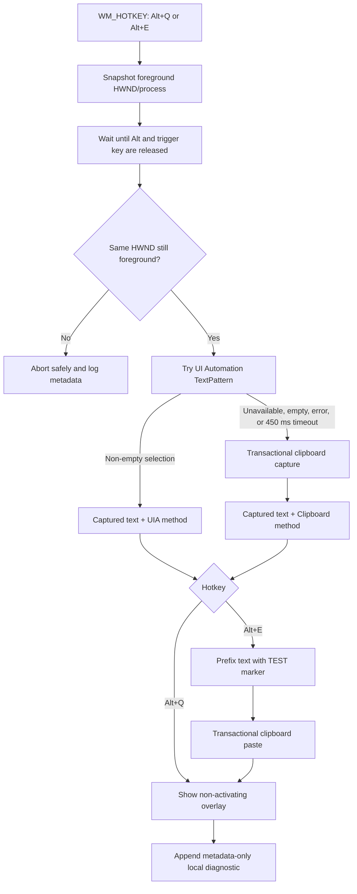
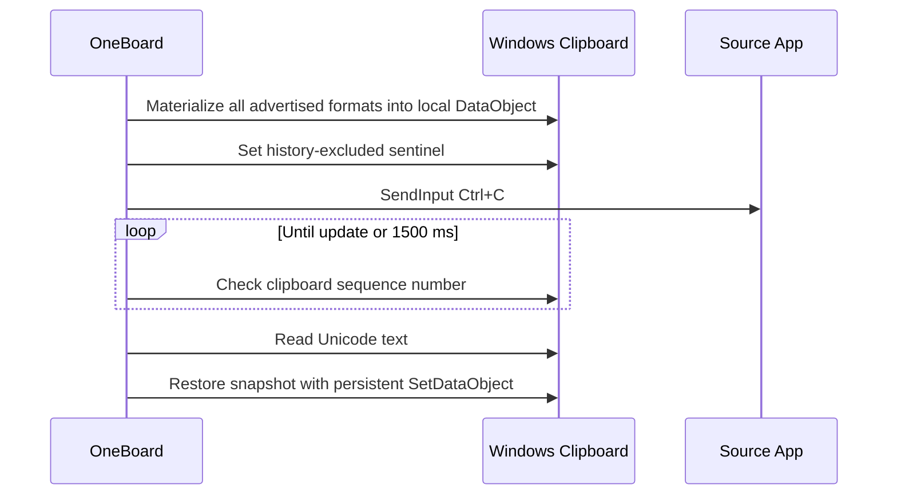

# Architecture

## Purpose and boundary

OneBoard Inline Translate Phase 0 answers one question: can a Windows process capture and replace the user's current selection across the five target application categories without taking focus, leaving clipboard data behind, or sending a message?

It is a single local WPF process. There is no database, network client, telemetry SDK, translation component, OCR engine, authentication layer, installer, or update service.

## Runtime flow



The coordinator permits only one hotkey operation at a time. Repeated keydown notifications are suppressed by `MOD_NOREPEAT`, and a second operation is ignored while the first owns the operation gate.

## Components

| Component | Responsibility |
|---|---|
| `GlobalHotkeyService` | Registers Alt+Q and Alt+E and converts `WM_HOTKEY` into typed actions. |
| `ForegroundWindowService` | Snapshots HWND, process/thread identity, and verifies that the source remains foreground. |
| `UiaSelectionReader` | Finds the keyboard-focused element beneath the foreground window, walks ancestors, and reads non-degenerate `TextPattern` selection ranges. |
| `SelectedTextCaptureService` | Runs UIA as a bounded, single-flight attempt and routes failures to clipboard capture. |
| `ClipboardSelectionReader` | Installs a sentinel, emits Ctrl+C, waits for the clipboard sequence number to change, and reads Unicode text. |
| `ClipboardTransaction` | Eagerly clones every advertised clipboard format, provides temporary data, retries contention, and restores a persisted snapshot on every exit path. |
| `TextReplacementService` | Places the Phase 0 value on the temporary clipboard, revalidates foreground HWND, emits Ctrl+V, allows paste consumption, and restores the clipboard. |
| `KeyboardInputService` | Uses correctly sized x64 `SendInput` structures for Ctrl+C and Ctrl+V only. |
| `OverlayWindow` | Shows process, captured text, method, and timing without activation. |
| `LocalDiagnosticLogger` | Appends allow-listed JSON Lines records beneath `%LOCALAPPDATA%`. |
| `PhaseZeroTransformer` | Implements only `[TEST] ` prefixing. |

## Capture pipeline

### 1. Foreground snapshot

The window handle is captured synchronously inside the `WM_HOTKEY` handler before any await. The process name is diagnostic/display metadata; the HWND is the authority for safety decisions.

### 2. UI Automation

UIA work executes on a worker thread because third-party providers can be slow or re-entrant. The caller waits at most 450 ms. A semaphore allows only one outstanding UIA provider call; if a provider stalls indefinitely, later captures go directly to the clipboard instead of creating unbounded stuck calls.

The reader starts at the keyboard-focused element within the foreground window, attempts `TextPattern`, and walks up the raw accessibility tree. Only non-degenerate, non-empty selection ranges succeed. Multiple ranges are joined with the platform newline.

### 3. Clipboard fallback



The sequence-number sentinel prevents stale clipboard text from being mistaken for the selection. Clipboard calls retry short-lived contention. Restoration ignores operation cancellation and receives a longer retry window than ordinary reads/writes. Snapshot values are cloned by type (strings, arrays, streams, bitmap sources, URIs, value types, and cloneable objects) and restored with `copy:true`, which persists them independently of the external clipboard owner's delayed-rendering lifetime. If any advertised format is null or uses an unsupported type, the transaction refuses to start before any clipboard mutation.

## Replacement pipeline

Standard UI Automation has no general selected-range write operation. `TextPatternRange` is read-only, while `ValuePattern.SetValue` replaces an entire control and can destroy surrounding user content. Phase 0 therefore does not use unsafe UIA replacement.

Replacement takes a fresh eager multi-format snapshot, places Unicode text on a temporary data object, verifies that the original HWND is still foreground, and sends Ctrl+V. A 350 ms settle interval leaves the temporary provider available while Office/Chromium/Electron dispatch the paste. The persistent snapshot is then restored.

No code emits Enter, invokes a send button, calls a submit API, or inspects target-app internals.

## Focus and overlay invariants

- Input is sent only when `GetForegroundWindow()` equals the hotkey-time HWND.
- Alt and the trigger key must be physically released before Ctrl+C/Ctrl+V injection.
- The overlay has `WS_EX_NOACTIVATE`, `WS_EX_TOOLWINDOW`, and `WS_EX_TRANSPARENT`.
- WPF uses `ShowActivated=false`, `Focusable=false`, and `IsHitTestVisible=false`.
- Native positioning uses `SWP_NOACTIVATE`.
- A `WM_MOUSEACTIVATE` guard returns `MA_NOACTIVATE`.

The program never calls `SetForegroundWindow`; it will not pull the user back if they intentionally switch applications.

## Threading model

- The WPF dispatcher is the owning STA for clipboard snapshot, mutation, and restoration operations.
- `await` continuations for capture/replacement return to that dispatcher.
- UI Automation provider calls run on a worker thread and never mutate the clipboard or inject input.
- One coordinator semaphore serializes complete hotkey operations.
- One logger semaphore serializes JSON Lines appends.

## Diagnostics and data handling

`DiagnosticRecord` has exactly six serialized properties: timestamp, process, capture method, success, latency, and exception type. Its constructor has no captured-text parameter. Exception messages and stack traces are not serialized. Smoke checks reflect over the JSON schema and verify that an exception message containing sensitive sample text is absent.

Captured text exists transiently in process memory and in the non-activating overlay because those are required functions. During clipboard fallback it also exists temporarily in the Windows clipboard provider. Temporary data advertises the presence-based Windows `ExcludeClipboardContentFromMonitorProcessing` format, which [excludes the item from history and cloud synchronization](https://learn.microsoft.com/windows/win32/dataxchg/clipboard-formats#cloud-clipboard-and-clipboard-history-formats).

## Source layout

```text
src/OneBoardInlineTranslate/                WPF executable
  Diagnostics/                              local allow-listed logging
  Infrastructure/                           Win32/clipboard, hotkeys, foreground, input
  Models/                                   pipeline result/value types
  Services/                                 capture and replacement pipelines
tests/OneBoardInlineTranslate.SmokeTests/   zero-package executable checks
tests/manual/selection-fixture.html         local Chrome/Edge test surface
scripts/                                    build and run entry points
```

## Failure policy

Safety wins over completion:

- changed foreground HWND → abort;
- unreleased hotkey modifiers → abort;
- clipboard cannot be snapshotted → do not modify it;
- copy does not update the sequence number → time out and restore;
- UIA stalls → use clipboard fallback, with at most one stalled UIA call;
- clipboard restoration reports failure → mark the operation failed after extended retries;
- overlay cannot activate by style and message handling.

Cross-application reliability is established only through the versioned manual matrix; a build result alone does not meet the Phase 0 PASS definition.
